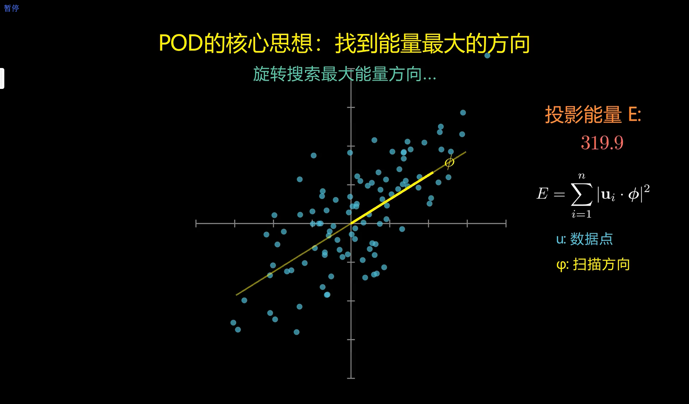

# POD-and-SPOD: 可视化学习指南

本项目旨在通过直观的动画，解释本征正交分解 (POD) 及其扩展概念，主要面向本科生。

## 项目结构

-   `/POD/1_Geometric_animation_of_POD/`: 包含一个基于 Manim 的动画，用于可视化解释 POD 的核心概念。
-   `/POD/2_Mathematical_principles_of_POD/`: (规划中) 将包含深入的数学推导和代码实现。

## 快速开始：POD 动画

本项目的核心是一个 3Blue1Brown 风格的动画，旨在帮助直观地理解 POD。动画从一个 2D 数据集开始，寻找其主要能量模态，并最终将概念扩展到 3D。

### 运行步骤

1.  **克隆仓库**
    ```bash
    git clone https://github.com/your-username/POD-and-SPOD.git
    cd POD-and-SPOD/POD/1Geometric_animation_of_POD
    ```

2.  **安装依赖**
    ```bash
    pip install manim numpy
    ```

3.  **渲染动画**
    ```bash
    python render_pod_split.py
    ```
    更详细的说明，请参阅动画目录下的 `README_POD_Educational.md` 文件。

### 效果预览



## 未来计划

-   [ ] 完成 `2_Mathematical_principles_of_POD` 部分的内容。
-   [ ] 增加关于谱本征正交分解 (SPOD) 的内容。

## 贡献

欢迎任何形式的贡献。如果您有任何建议，请随时提交 Pull Request 或开启一个 Issue。
